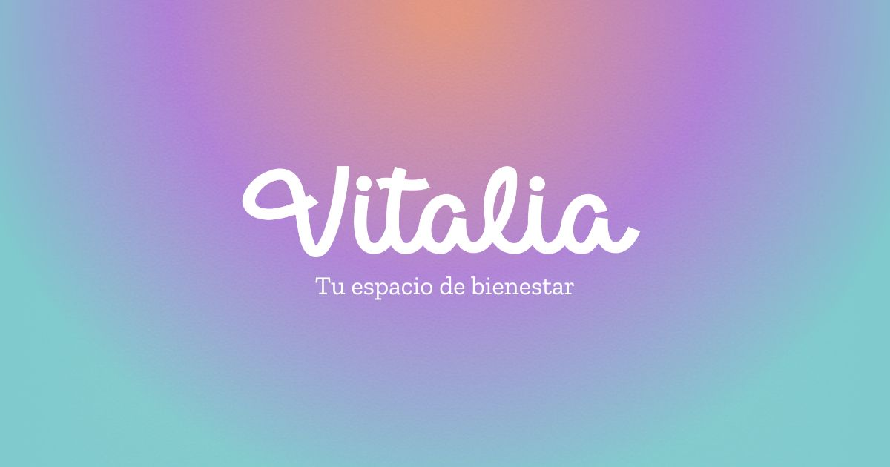

  
  <h1>Vitalia | Tu Plataforma Integral de Bienestar Impulsada por IA</h1>
  <h3>Transformando tu calidad de vida de forma efectiva y completamente personalizada.</h3>

  

    <a href="https://vitalia-selfcare.vercel.app/"><strong>Explora la plataforma »</strong></a>
  

   
  
   

 

## 🌟 Sobre el Proyecto

**Vitalia** es un espacio diseñado para cuidar tanto tu salud física como mental. Sabemos que el bienestar integral requiere de equilibrio, por eso hemos creado una plataforma inteligente que, mediante algoritmos de inteligencia artificial, analiza tus necesidades, objetivos y estado de ánimo para ofrecerte el plan perfecto de autocuidado.

Desde el primer momento en que interactúas con Vitalia, te sumerges en una experiencia interactiva, fluida y visualmente atractiva, diseñada para transmitir paz y motivación, con componentes modernos e inmersivos.

## ✨ Características Principales

- 🌱 **Planes 100% Personalizados:** Rutinas de ejercicio, meditaciones guiadas y guías de nutrición (dietas) creadas a tu medida por nuestro motor inteligente.
- 💬 **Apoyo en Tiempo Real:** Un chatbot asistente integrado que te acompaña, ofreciendo recomendaciones instantáneas y apoyo emocional 24/7.
- 📚 **Contenido Exclusivo:** Acceso a una rica biblioteca de artículos, rutinas y recursos ("Mi Espacio" y Blog) para ayudarte a mejorar cada día.
- 🎨 **Experiencia Dinámica UI/UX:** Interfaz de usuario fluida con animaciones modernas y diseño *bento box* ("Magic Bento").

## 🛠️ Tecnologías Utilizadas

Vitalia está construido utilizando una mezcla de tecnologías y librerías modernas para asegurar un rendimiento óptimo y un diseño deslumbrante:

- **Estructura y Estilos:** HTML5, CSS3 (CSS Variables, Grid, Flexbox), JavaScript.
- **Interactividad Reactiva:** React.js, Babel (para compilación en cliente de componentes puntuales).
- **Animaciones 2D y 3D:** GSAP (Scroll animations), Framer Motion, y Three.js (efecto interactivo líquido tipo WebGL en hero).
- **Ecosistema UI:** Bootstrap Icons.
- **Despliegue:** [Vercel](https://vercel.com/)

## 🚀 Comienza tu viaje

¿Listo para dar el siguiente paso en tu autocuidado? Únete a nosotros y descubre un ecosistema que realmente entiende y se adapta a tus necesidades.

🔗 **[Visita Vitalia y crea tu plan gratuito aquí](https://vitalia-selfcare.vercel.app/)**. ¡Es tu momento de transformar tu vida!

## 📬 Únete a la Comunidad

¿Quieres aportar, hacernos una consulta, o solo venir a saludar? ¡Nuestros canales siempre están abiertos!

- 💌 **E-mail:** [vitalia.selfcare@gmail.com](mailto:vitalia.selfcare@gmail.com)
- 📸 **Instagram:** [@vitalia.web](https://www.instagram.com/vitalia.web/)

---

  <i>Construyendo mejores mañanas 💜</i>

